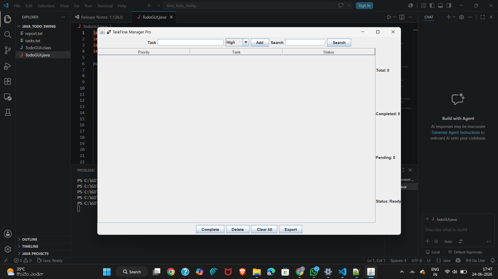
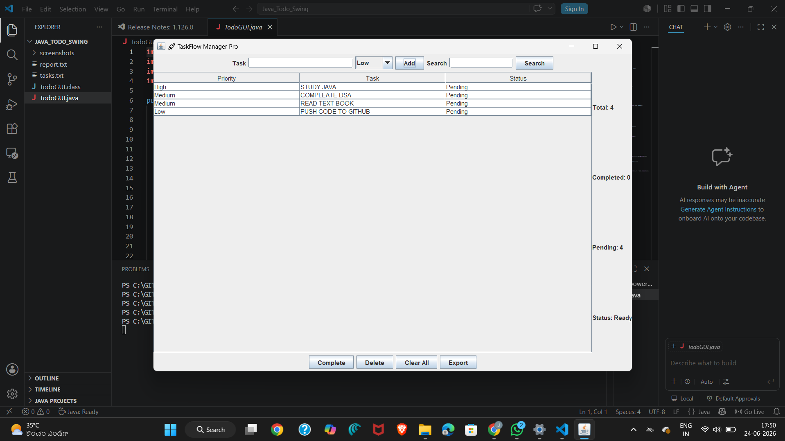
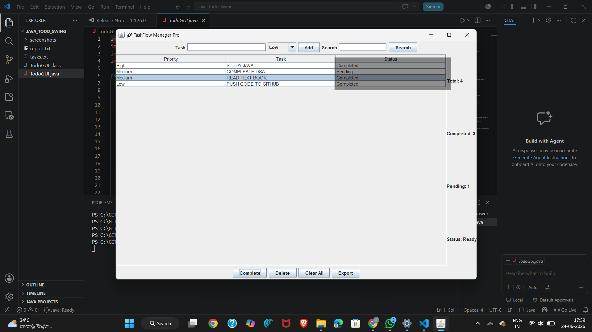
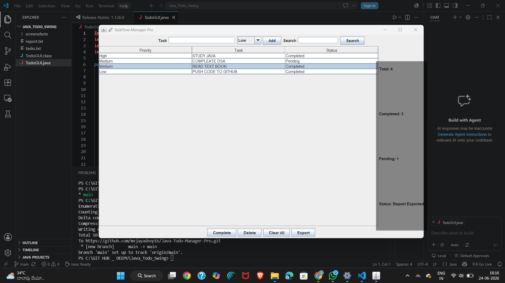

# 🚀 TaskFlow Manager Pro

A professional desktop-based To-Do Manager developed using Java Swing. This application helps users organize, prioritize, track, and manage daily tasks efficiently through an intuitive graphical interface.

---

## 📌 Project Overview

TaskFlow Manager Pro is a productivity application built with Java Swing that allows users to:

- Create tasks
- Assign priorities
- Track completion status
- Search tasks
- Delete tasks
- Export reports
- Save and load tasks automatically

This project demonstrates GUI development, file handling, event handling, data management, and object-oriented programming concepts in Java.

---

## ✨ Features

### 📋 Task Management
- Add Tasks
- Complete Tasks
- Delete Tasks
- Clear All Tasks

### 🎯 Priority Levels
- 🔴 High Priority
- 🟡 Medium Priority
- 🟢 Low Priority

### 🔍 Search Functionality
Quickly find tasks using keywords.

### 📊 Statistics Dashboard
Displays:
- Total Tasks
- Completed Tasks
- Pending Tasks

### 💾 Data Persistence
- Automatically saves tasks
- Automatically loads tasks on startup

### 📄 Export Report
Generate a task report and save it to:

report.txt

---

## 🛠 Technologies Used

| Technology | Purpose |
|------------|----------|
| Java | Programming Language |
| Swing | GUI Development |
| JTable | Task Management Table |
| File Handling | Data Persistence |
| VS Code | Development Environment |
| Git & GitHub | Version  Control |

---

## 📂 Project Structure

```text
Java-Todo-Manager-Pro
│
├── TodoGUI.java
├── tasks.txt
├── report.txt
├── README.md
│
└── screenshots
    ├── home.png
    ├── add-task.png
    ├── completed-task.png
    └── statistics.png
```

## 📸 Screenshots

### Home Screen



### Add Tasks



### Completed Tasks



### Statistics Dashboard



---

## ▶️ How To Run

### Compile

```bash
javac TodoGUI.java
```

### Run

```bash
java TodoGUI
```

---

## 🎓 Concepts Practiced

- Java Fundamentals
- Object-Oriented Programming
- Java Swing GUI
- JTable
- Event Handling
- File Handling
- Data Persistence
- CRUD Operations
- Git & GitHub

---

## 🚀 Future Improvements

- Dark Theme
- Due Dates
- Calendar Integration
- User Authentication
- Database Storage
- Notifications & Reminders

---

## 👨‍💻 Author

**Venkata Jayadeep Maddipatla**

B.Tech Computer Science and Engineering

SRM Institute of Science and Technology (SRMIST)

---

⭐ If you like this project, consider giving it a star on GitHub.
